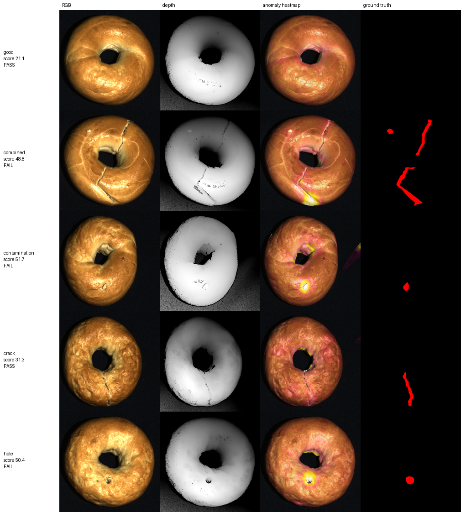

# Point Cloud Defect Inspection API

Upload a 3D scan of a manufactured part, get back an anomaly heatmap and a calibrated
pass/fail decision. No defect labels needed: the model learns from defect-free scans only.

**Live demo:** [https://pcinspect-727953311125.asia-northeast1.run.app/demo](https://pcinspect-727953311125.asia-northeast1.run.app/demo) (Cloud Run, scales to zero: first load takes 15-20 s) | **API docs:** [https://pcinspect-727953311125.asia-northeast1.run.app/docs](https://pcinspect-727953311125.asia-northeast1.run.app/docs)



*Bagel category of MVTec 3D-AD: RGB, depth, anomaly heatmap, ground truth. Contamination,
hole and the combined defect are caught; the hairline crack scores below threshold.*

## The client problem

Manufacturing QA teams increasingly have 3D scanners (Zivid, Photoneo, Keyence, Cognex) but no
labelled defects. Supervised detectors need hundreds of annotated examples per defect type and
miss anything new. This service needs 50 to 300 scans of good parts and flags whatever deviates
geometrically: dents, holes, cracks, cuts, bends, contamination, missing material.

## Results on MVTec 3D-AD (10 categories, 3D only)

| Category | Image AUROC | Pixel AUROC | AUPRO@30% | Recall @thr | False alarms @thr | Latency (ms, CPU) |
|---|---|---|---|---|---|---|
| bagel | 0.975 | 0.893 | 0.862 | 0.94 | 0.14 | 650 |
| cable_gland | 0.656 | 0.901 | 0.770 | 0.13 | 0.00 | 364 |
| carrot | 0.953 | 0.955 | 0.920 | 0.98 | 0.15 | 545 |
| cookie | 0.981 | 0.845 | 0.807 | 0.97 | 0.18 | 488 |
| dowel | 0.945 | 0.818 | 0.707 | 0.66 | 0.00 | 374 |
| foam | 0.548 | 0.874 | 0.598 | 0.06 | 0.05 | 797 |
| peach | 0.971 | 0.923 | 0.861 | 0.88 | 0.08 | 476 |
| potato | 0.991 | 0.984 | 0.961 | 0.85 | 0.00 | 458 |
| rope | 0.990 | 0.890 | 0.799 | 0.99 | 0.09 | 471 |
| tire | 0.410 | 0.941 | 0.827 | 0.07 | 0.16 | 543 |
| **mean** | **0.842** | **0.903** | **0.811** | 0.65 | 0.08 | 517 |

Threshold column: recall on defective test scans and false-alarm rate on good test scans at the
95th-percentile validation threshold. Latency is per 800x800 scan, single process, CPU only.

Reference: the FPFH-only baseline of "Back to the Feature" (Horwitz and Hoshen, 2023) reports a
mean image AUROC of 0.782 on the same benchmark; their RGB+3D fusion reaches 0.865.

**Known failure case: tire.** Image AUROC is below chance even though localisation inside each
scan is good (pixel AUROC 0.94). The finely grooved black rubber gives the sensor many no-return
holes; the geometric peaks on good scans are as strong as real defects. Seven scoring variants
were tested offline (`results/image_score_variants.md`); none fix it. An RGB-fused or learned
feature is the next step for that class of part.

Per-category figures (RGB, depth, heatmap, ground truth; one row per defect type): [bagel](assets/bagel.png), [cable_gland](assets/cable_gland.png), [carrot](assets/carrot.png), [cookie](assets/cookie.png), [dowel](assets/dowel.png), [foam](assets/foam.png), [peach](assets/peach.png), [potato](assets/potato.png), [rope](assets/rope.png), [tire](assets/tire.png).

**Ablations** (all in `results/`: a 40k greedy coreset matches the full 975k-feature bank on
bagel (0.990 vs 0.990 image AUROC) at 14x lower latency; a per-category point budget of 3,000
beats a fixed 2 mm voxel on small parts (`sweep_cable_gland.md`); radius outlier removal
before FPFH removes stray hole-edge points that otherwise dominate the image score.

## How it works

1. **Preprocess** (Open3D): drop no-return pixels, RANSAC plane fit to remove the table, keep
   points on the camera side, voxel downsample to a per-category budget of about 3,000 points,
   radius outlier removal, normal estimation.
2. **Describe**: 33-d FPFH descriptor per point (rotation invariant local surface shape).
3. **Memory bank**: FPFH features of all defect-free training scans, reduced to 40,000 entries by
   greedy k-center coreset. Stored as a 5 MB `.npz` per category.
4. **Score**: Euclidean distance to the nearest bank entry (FAISS, exact). Point scores are
   painted back onto the sensor's pixel grid through the organized-cloud index and smoothed with
   a normalised Gaussian; image score is the mean of the top 1% of point scores.
5. **Decide**: threshold at the 95th percentile of image scores on defect-free validation scans.
   The API returns the raw score and the threshold so the operating point can be moved without
   retraining.

Latency and hardware are in the benchmark table below.

**Latency per stage** (median over 20 test scans, single process, Intel Core i7 8th/9th gen desktop, no GPU):

| Stage | bagel, 800x800 (ms) | cable_gland, 400x400 (ms) |
|---|---|---|
| load | 9 | 4 |
| preprocess | 385 | 135 |
| fpfh | 30 | 25 |
| search | 217 | 166 |
| heatmap | 35 | 10 |
| total | 657 | 337 |

Preprocessing (RANSAC plane fit, voxelisation, outlier removal, normals) dominates; the 40k-entry FAISS
search is the second cost. Both scale with point count, not with bank size beyond 40k. GPU is not needed.

## API

```
GET  /health                     -> {"status": "ok", "categories": [...]}
GET  /categories                 -> bank size and threshold per category
POST /inspect?category=bagel     -> JSON: image_score, threshold, is_defective, n_points,
                                   latency_ms, heatmap_png_base64
POST /inspect/heatmap.png?category=bagel -> PNG heatmap, score in X-Image-Score header
```

Input: an organized xyz scan, HxWx3 float32 TIFF in metres, zeros where the sensor got no
return. Any structured-light scanner exports this. Interactive docs at `/docs`.

## Run

```bash
python -m venv .venv && .venv/Scripts/pip install -e .[dev] faiss-cpu
python scripts/download_mvtec3d.py --categories bagel      # or no flag for all 14 GB
python scripts/build_bank.py --categories bagel
python scripts/evaluate.py --categories bagel
uvicorn pcinspect.api.app:app --port 8000
curl -F "file=@scan.tiff" "localhost:8000/inspect?category=bagel"
```

The fitted banks for all ten categories are committed under `models/` (35 MB), so the API and
demo work straight from a checkout.

## Deploy

One container serves the API (`/docs`) and the Gradio demo (`/demo`):

```bash
docker build -t pcinspect . && docker run -p 8000:8000 pcinspect
```

Cloud Run one-liner and why serverless hosts (Vercel, Lambda) cannot run this (Open3D's Linux
wheel alone is 448 MB against a 250 MB function limit): see [docs/DEPLOY.md](docs/DEPLOY.md).
Hosted on Google Cloud Run: [https://pcinspect-727953311125.asia-northeast1.run.app/demo](https://pcinspect-727953311125.asia-northeast1.run.app/demo).

## Tests

```bash
pytest -q
```

13 tests, including synthetic scans (table + dome + dent) that exercise the full pipeline and
the API without the dataset, and regression tests for the AUPRO metric's tie handling.

## Repository layout

```
pcinspect/            package: data loader, preprocess, features/fpfh, models/memory_bank,
                      inspector, metrics, api/app
scripts/              download, build_bank, evaluate, run_all, sweep, benchmark, make_figure,
                      build_space
models/               fitted banks + thresholds, one folder per category (5 MB each)
demo/                 Gradio app + example scans
docs/PLAN.md          milestones;  docs/LEARNING.md  concepts, debugging stories, reading list;
                      docs/DEPLOY.md  Cloud Run / Docker / hosting notes
results/              metrics, sweeps, ablations
```

## Data and licence

MVTec 3D-AD (Bergmann et al., VISAPP 2022) is CC BY-NC-SA 4.0; the six example scans in
`demo/examples` are included for non-commercial demonstration only. Code is MIT.
